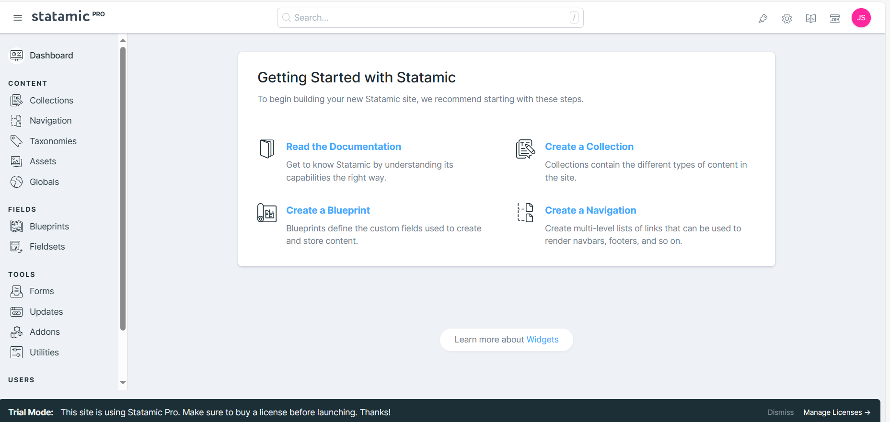
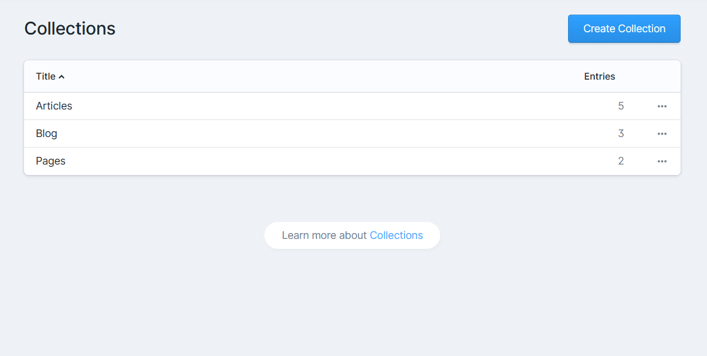
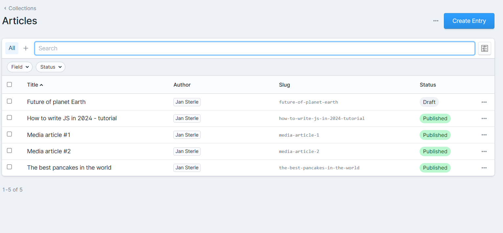
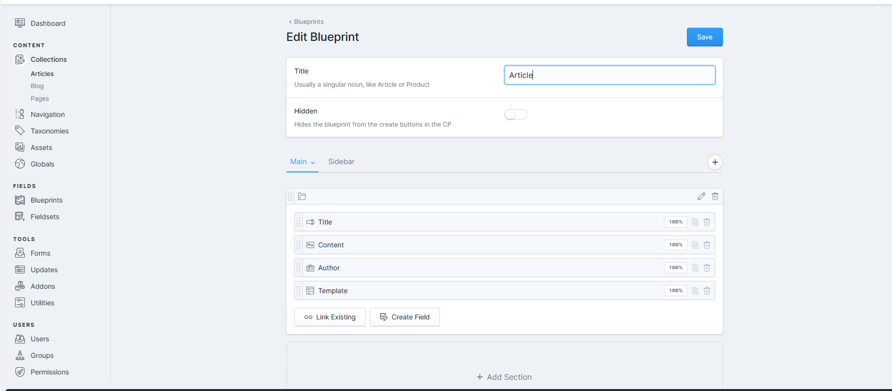
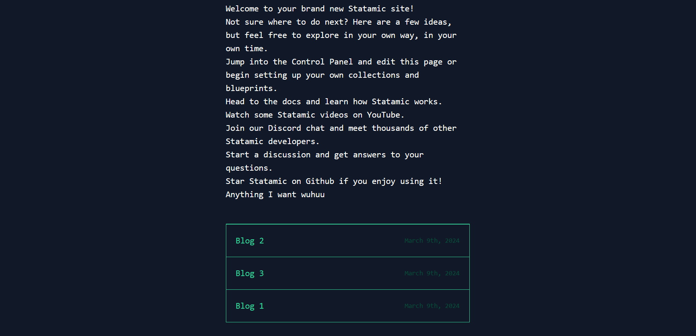
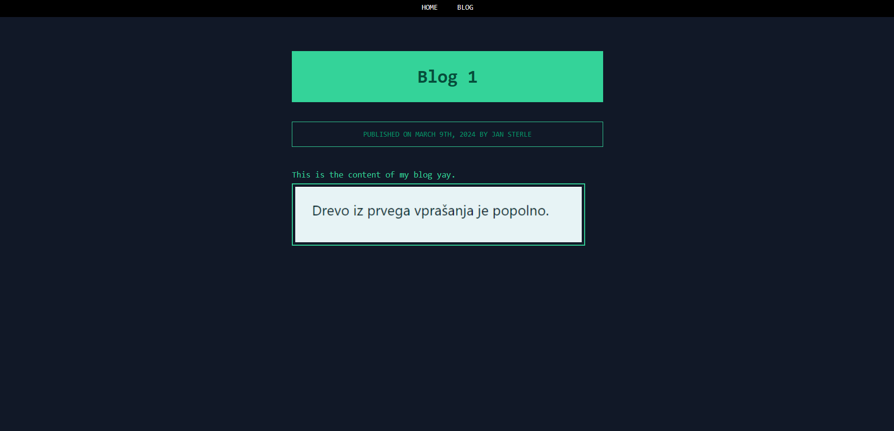
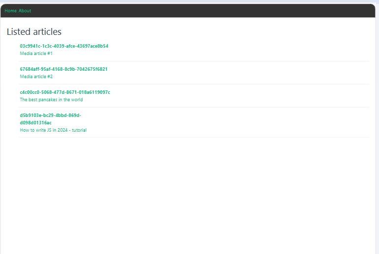
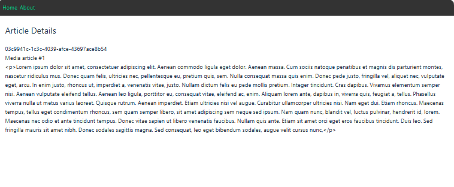

## About Statamic

Statamic is the flat-first, Laravel + Git powered CMS designed for building beautiful, easy to manage websites.

> **Note:** This repository contains the code for the Statamic application. To contribute to the core package, visit the [Statamic core package repository][cms-repo].

## Learning Statamic

Statamic has extensive [documentation][docs]. We dedicate a significant amount of time and energy every day to improving them, so if something is unclear, feel free to open issues for anything you find confusing or incomplete. We are happy to consider anything you feel will make the docs and CMS better.

## Support

We provide official developer support on [Statamic Pro](https://statamic.com/pricing) projects. Community-driven support is available on the [forum](https://statamic.com/forum) and in [Discord][discord].

## Contributing

Thank you for considering contributing to Statamic! We simply ask that you review the [contribution guide][contribution] before you open issues or send pull requests.

## Code of Conduct

In order to ensure that the Statamic community is welcoming to all and generally a rad place to belong, please review and abide by the [Code of Conduct](https://github.com/statamic/cms/wiki/Code-of-Conduct).

## Important Links

- [Statamic Main Site](https://statamic.com)
- [Statamic Documentation][docs]
- [Statamic Core Package Repo][cms-repo]
- [Statamic Migrator](https://github.com/statamic/migrator)
- [Statamic Discord][discord]

[docs]: https://statamic.dev/
[discord]: https://statamic.com/discord
[contribution]: https://github.com/statamic/cms/blob/master/CONTRIBUTING.md
[cms-repo]: https://github.com/statamic/cms

## Documentation for this project

### What's this all about?

It's a statamic project. Statamic is a CMS that allows us to easily add new collections(blogs, articles...) to our page. It can serve html on backend using antlers templating engine. It also provides support for blade templating engine which is used by laravel projects by default. If we want to use custom frontend(vue.js, angular...) we can do that, since statamic provides us with a REST api that can expose **Collections**, **Taxonomies**, **Assets** and some other Global objects related to Statamic control panel.

### How do you create such project?

`composer create-project --prefer-dist statamic/statamic statamic-backend`

### How to run the project

It depends. I have set up local environment using Laragon that uses Apache behind the scenes(software provides similiar functionality to XAMPP but it's easier to use).

The default domain on where you can see the project is:
`http://statamic-backend.test/`.

And there is also control panel:
`http://statamic-backend.test/cp/dashboard`.

To use the control panel you need to create a super user via command:

`php please make:user`

In this project I created a user with an email jan.sterle123@gmail.com and a password
jan12345. You could easily change that under /users folder inside **youremail**.yaml file.

### How does this stuff look?

#### This is statamic's default control panel which includes everything you need to build a website

#### Collections(models) we can create and expose them to our frontend

#### Example of collections, articles that are in draft are not queried

#### Blueprint of article collection (here we can add new attributes and change them)

#### Frontend using antlers templating engine

You can view the code under **./resources/views/*.antlers.html**

#### blogs with antlers templating engine

#### articles on the frontend through the REST API

#### detailed article on the frontend through the REST API

### REST API

We can expose our REST api that is **ONLY** available on PRO version of statamic CMS (You can use the pro version locally and experiment stuff which is pretty cool)

**All articles entries**

**[GET]** `http://statamic-backend.test/api/collections/articles/entries`

**Articles sorted by title**

**[GET]** `http://statamic-backend.test/api/collections/articles/entries?sort=title`

**Articles sorted by title - reversed**

**[GET]** `http://statamic-backend.test/api/collections/articles/entries?sort=-title`

**Articles but with id and title fields only**

**[GET]** `http://statamic-backend.test/api/collections/articles/entries?fields=id,title`

**Specific article by id**

**[GET]** `http://statamic-backend.test/api/collections/articles/entries/{id}`

**Article pagination**

**[GET]** `http://statamic-backend.test/api/collections/articles/entries?fields=id,title&limit=2&page=1`

For further documentation check [Statmic docs on REST api](https://statamic.dev/rest-api)

